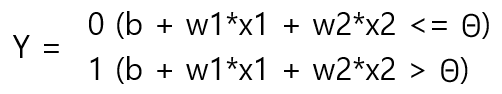
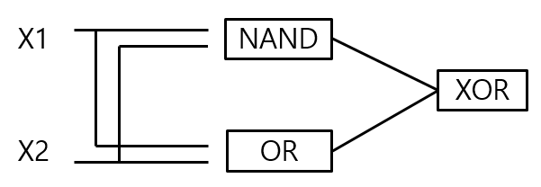

# # 01 퍼셉트론


퍼셉트론은 현재는 쓰이지 않지만 신경망과 딥러닝으로 나아가는데 중요한 아이디어를 배우기 위한 중요한 개념이다.

컴퓨터 구조를 조금 공부했다면 쉽게 이해할 수 있다.


## 1. 퍼셉트론이란 ?


**퍼셉트론은 다수의 신호를 입력으로 받아 하나의 신호를 출력한다. ** 

**즉 입력신호와 가중치를 곱하고 편향을 더해 정해둔 임계치를 넘을 경우 1을 출력하고 아닐 경우 0을 출력한다  **




## 2. 퍼셉트론의 구현과 한계

퍼셉트론은 구현이 간단하지만 단순 퍼셉트론으로는 XOR 게이트를 구현할 수 없다는 단점이 있다.

아래는 퍼셉트론으로 NAND를 구현한 것인데 AND, OR, NAND는 w와 b만 달라진다.

```python
import numpy as np

# AND의 x1, x2는 0, 1이다.
def AND(x1, x2):
	x = np.array([x1, x2])
    w = np.array([0.5, 0.5])
    b = -0.7
    tmp = np.sum(w*x) + b
    if tmp <= 0:
        return 0
    else:
        return 1
    
def NAND(x1, x2):
    x = np.array([x1, x2])
    w = np.array([0.5, 0.5])
    b = -0.7
    tmp = np.sum(w*x) + b
    if tmp <= 0:
        return 0
    else: 
        return 1
    
def OR(x1, x2):
    x = np.array([x1, x2])
    w = np.array([0.5, 0.5])
    b = -0.2
    tmp = np.sum(w*x) + b
    if tmp <= 0:
        return 0
    else: 
        return 1
```


## 3. 다층 퍼셉트론

퍼셉트론은 이 한계를 퍼셉트론을 여러개 쌓는 다층 퍼셉트론으로 극복했다.



```python
def XOR(x1, x2):
    s1 = NAND(x1, x2)
    s2 = OR(x1, x2)
    y = AND(s1, s2)
    return y
```

