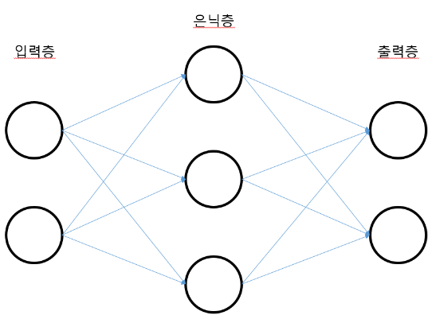
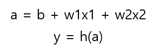
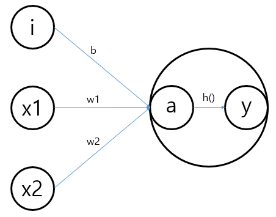

# # 02 신경망


## 01. 신경망과 퍼셉트론은 뭐가 다를까 ?


신경망과 퍼셉트론의 가장 큰 차이점은 앞서 퍼셉트론에서도 보았던 가중치 매개변수를 알아서 적절한 값으로 학습하는 능력이 있다는 점이다.

신경망은 아래의 그림처럼 입력층, 은닉층, 출력층으로 나뉘며 은닉층은 말 그대로 입출력값으로 안보이기 때문에 은닉층이다. 



## 02. 활성화 함수란 ?


신경망과 퍼셉트론의 구현상의 차이점은 활성화 함수가 있다는 것이다. 

활성화 함수란 입력 신호의 총합을 출력 신호로 변환하는 함수로 **입력 신호의 총합이 활성화를 일으키는지를 정하는 것**이다.

수식과 그림으로는 아래와 같이 나타낼 수 있으며 여기서 **y를 출력하는 h()를 활성화함수라고 한다.**







## 03. 활성화 함수의 종류


다행히도 활성화 함수를 직접 만들 필요는 없고 이미 누군가 만들어 놨다. 아마도 이러한 활성화 함수에 세부적인 조절을 하면서 조금이나마 정확도를 높이려는 노력도 있을 수 있겠다는 생각이 들지만 아직 내가 알기는 어려울 것 같다. 내년 요맘 때 쯤에는 좀 알려나...?


### 01. 계단 함수


계단 함수란 말 그대로 함수의 그래프 도형이 계단처럼 만들어지는 함수이다. 어제 만들어 본 퍼셉트론이 이러한 구조를 갖고 있다.

```python
def step_function(x):
    y = x > 0
    return y.astype(np.int)

#astype은 원하는 자료형으로 바꿔주는 역할을 하는 numpy 메서드이다.
```


### 02. 시그모이드 함수


시그모이드 함수는 출력값(y값)이 0에서 1사이로 곡선형의 비선형 함수이다.

```python
def sigmoid(x):
    return 1 / (1 + np.exp(-x))

# np.exp(-x)는 시그모이드 함수가 워낙 많이 쓰이기 때문에 numpy에서 만들어놓은 exp()연산 메서드이다.
```


### 03. ReLU 함수


ReLU 함수도 마찬가지로 비선형이지만 0을 기점으로 대각선으로 뻗어나가는 형태를 갖고 있다. 

```python
def relu(x):
    return np.maximum(0, x)
```


## 04. 3층 신경망 구현하기


## 05. 출력층 구현하기(소프트맥스 함수로)


